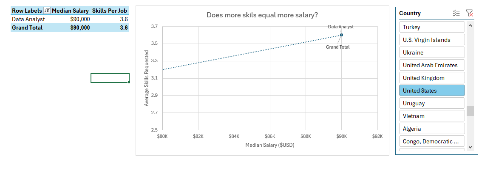
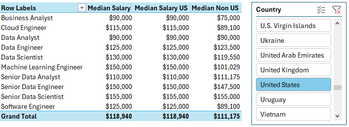
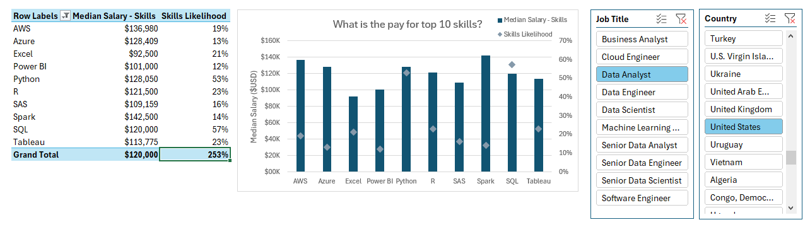
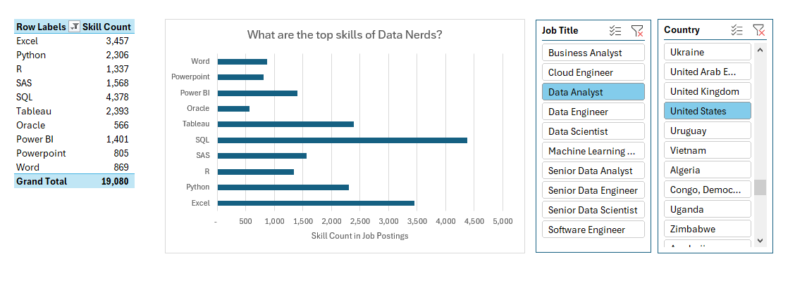

# 📊 Global Data Market Intelligence: A Strategic Skill-Value Analysis

---

# 📌 Executive Summary
In a high-stakes job market, career decisions must be backed by data, not intuition. This project is a sophisticated **Market Intelligence Tool** engineered to quantify the financial "Return on Investment" (ROI) of technical skills within the global data ecosystem.

By architecting a relational data model in **Excel Power Pivot** to analyze a dataset of **32,672 job postings**, I have identified the high-yield skill paths that optimize for both long-term job security and aggressive financial growth.

---

# 🛠️ Technical Architecture & Workflow
This project showcases the transition from basic spreadsheets to **Advanced Business Intelligence (BI)** engineering:

* **ETL & Data Engineering:** Leveraged Power Query to perform complex transformations, normalization, and parsing of comma-separated skill strings from 30,000+ records.
* **Relational Data Modeling:** Architected a **Star Schema** within Power Pivot. This involved establishing a central Fact Table (Job Postings) connected to Dimension Tables (Skills, Geography, Roles) to enable deep, multi-dimensional analysis.
* **Advanced DAX Logic:** Developed custom DAX measures to calculate dynamic metrics such as **Skill Likelihood**, **Median Salary Benchmarks**, and the **US-Geographic Premium**.

---

# 📸 Decision-Support Dashboards

### 1. Skill-to-Salary ROI Mapping
A direct visualization of how technical specialization scales compensation.

### 2. Global Compensation Benchmarking
An interactive breakdown of market rates by role, providing critical salary transparency across 100+ countries.

### 3. The "Specialization Ceiling" Analysis
Identifying the specific niche tools (Cloud, Big Data) that act as catalysts for the highest salary jumps.

### 4. Role-Based Competency Matrix
A frequency map of the exact "skill stacks" employers are currently hiring for across every major data role.

---

# 📈 Strategic Deep Dive: Market Findings

The analysis reveals that the data job market is governed by **Technical Complexity** and **Geographic Economic Disparity**.

### 🚀 1. The Engineering Dividend (Architecture > Interpretation)
The data confirms a massive "Complexity Premium." Roles that require building and maintaining infrastructure (**Senior Data Engineer, ML Engineer**) command medians between **$147k – $155k**. Purely analytical roles (**Data Analyst**) act as a high-volume entry point with medians between **$60k – $90k**.
* **Strategic Takeaway:** True career "scaling" occurs when an analyst pivots toward engineering competencies like Cloud Architecture and Automation.

### 🛠️ 2. High-Yield vs. Mandatory Skills (The ROI Gap)
Technical skills are categorized into two distinct financial tiers:
* **The Mandatory Floor:** **SQL (56%)** and **Python (54%)** are "commoditized." They are non-negotiable for market entry, but they no longer act as unique salary differentiators.
* **The High-ROI Ceiling:** Skills like **Spark ($140k median)** and **AWS ($135k median)** appear in fewer postings (~18%) but correlate with a **15-25% salary increase** over the general median.
* **Strategic Takeaway:** Master the "Floor" for employability; master the "Ceiling" for wealth.

### 🌏 3. The "US-Premium" & Borderless Talent
The analysis proves the US market remains the global epicenter for high-end compensation:
* **Machine Learning Engineers** in the US earn a median of **$150,000**, representing a **48% premium** over their international counterparts ($101k).
* **Strategic Takeaway:** For global talent, the highest financial leverage is found in targeting US-based remote roles or multinational firms where the US pay scale is the reference benchmark.

---

# 💡 Strategic Roadmap & Conclusion

Based on this Power Pivot intelligence, I have developed a three-tier strategy for market optimization:

1.  **Phase 1 (Foundational):** Solidify **SQL and Python** as the core stack for immediate market entry.
2.  **Phase 2 (Growth):** Pivot toward **Cloud Infrastructure (AWS/Azure)** to move from a "Generalist" to a "Specialist" salary bracket.
3.  **Phase 3 (Mastery):** Adopt **Big Data Engineering (Spark/Java)** to align with the highest reported salary medians in the industry.

---

# 🧠 Skills & Competencies
* **Business Intelligence:** Star Schema Modeling, Relational Database Design.
* **Data Engineering:** ETL Processes, Data Normalization, String Parsing.
* **Strategic Analytics:** DAX Measure Creation, ROI Calculation, Trend Forecasting.
* **Communication:** Translating raw datasets into executive-level career strategy.

---

# 👤 Author
**Muhammad Rohail** *BS Entrepreneurship | Data Analyst & Strategy Enthusiast* GitHub: [https://github.com/rohailsr1](https://github.com/rohailsr1)  

---
